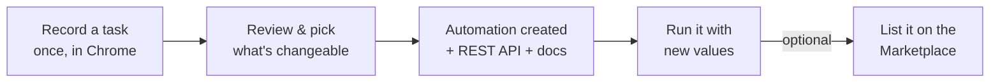

# FormAutomator

**Record a browser task once. Replay it forever as a REST API.**

FormAutomator watches you complete a task in a normal Chrome tab — searching for hotels, posting an announcement, filling out a form — and turns what you did into a reusable, parameterized automation you can re-run with new values, call from your own code as a documented REST API, or list on a built-in marketplace for other people to buy.

> Personal project, actively developed. Billing (subscriptions, marketplace purchases) is currently **simulated** — see [Project status & constraints](#project-status--constraints) below before assuming anything here moves real money.

---

## How it works



1. **Record** — click the extension, do the task normally, stop recording.
2. **Review** — FormAutomator guesses which fields you'll want to change next time (a destination, a date, a quantity) and lets you fine-tune them.
3. **Create** — it becomes a saved automation with an auto-documented REST API endpoint.
4. **Run** — fill in a simple form (or call the API directly) and it replays the task in a real headless browser, returning structured results.
5. **Sell** *(optional)* — list it on the marketplace so others can buy licensed, independent copies.

## Features

**Recording & replay**
- Chrome (Manifest V3) extension records clicks, typed values, dropdowns, checkboxes, and rich-text/contenteditable fields
- Each field gets several candidate selectors (id, name, label text, visible text, structural position) so replay survives minor site changes
- Automatically detects "changeable" fields — including ones only expressed as URL query parameters on click-driven sites
- Best-effort structured scraping of result pages (titles, prices, images) with zero configuration, plus explicit output-field extraction
- Screenshot returned on a failed run to help diagnose what broke

**Two automation types**
- **Browser automations** — anything recordable on any website
- **Email automations** — a dedicated SMTP-based "send an email" type through your own Gmail account (app password, encrypted at rest)

**Login-gated sites**
- Never scripts a login form or stores a password
- Instead captures your already-authenticated browser session (you log in normally, once) and replays that session on future runs

**Marketplace**
- List an automation for sale as single-use, a 100-use bulk pack, or a monthly subscription
- Dynamic platform fee that shrinks as the sale gets bigger, with a further discount for Pro/Enterprise sellers
- Automations with a connected login session or of the email type can never be listed — that would leak a live session or a Gmail credential to the buyer

**Plans & quotas**
- Free / Builder / Pro / Enterprise tiers gating daily automation-creation attempts (running existing automations is always unlimited)

**Input validation**
- Every changeable field is checked against its type before a run starts — realistic number ranges, real (non-past) dates, required fields, a live check against the target site's own destination autocomplete for location fields, valid email shape — both inline in the UI and as an API-level backstop

**Accounts & appearance**
- Email/password auth, forgot/reset password via emailed link, full self-service account deletion
- Light / dark / system theme, synced between the web app and the extension popup

## Tech stack

| Layer | Stack |
|---|---|
| Server | Express + TypeScript, `node:sqlite` (no native deps), JWT auth, Playwright (headless replay), Nodemailer |
| Web app | React + Vite + React Router |
| Extension | Chrome Manifest V3, esbuild |
| Shared | TypeScript types shared across server/web/extension |

## Repository structure

```
apps/server     Express + TypeScript backend (port 4000)
apps/web        React + Vite frontend (port 5173)
apps/extension  Chrome Extension, Manifest V3 (esbuild-bundled)
packages/shared TypeScript types shared by server + web
fixtures/       Static test site for exercising the extension locally
```

## Getting started

**Prerequisites:** Node.js 22.5+ (uses the built-in `node:sqlite` module — no native build step), Google Chrome.

```bash
# install everything (npm workspaces)
npm install

# build the shared types package first - server and web both depend on it
npm run build:shared

# run the API server (port 4000)
npm run dev:server

# in another terminal, run the web app (port 5173)
npm run dev:web
```

Open `http://localhost:5173`, sign up, and download the extension zip from the home page.

**Loading the extension:**
1. `npm run package-zip -w apps/extension` (bundles it and refreshes the zip served from the web app)
2. Open `chrome://extensions`, enable Developer mode, click **Load unpacked**, select `apps/extension/dist`

**Optional — local test site** for recording against something disposable instead of a real website:
```bash
npx --yes http-server fixtures/test-site -p 8080 -c-1
```

### Email automations (optional)

To actually send email (rather than the dev-mode fallback that just shows the link), copy `apps/server/.env.example` to `apps/server/.env` and fill in a Gmail address + [App Password](https://myaccount.google.com/apppasswords) for **password-reset emails**. Each individual email *automation* supplies its own sender App Password through the web UI instead, encrypted at rest.

## Project status & constraints

These are deliberate, current boundaries — not bugs:

- **No real payment processing.** Every subscription upgrade and marketplace purchase is simulated: it succeeds instantly and updates the database, with no real charge involved anywhere yet.
- **Never lists email automations or automations with a connected login session on the marketplace** — both would leak a live credential to the buyer.
- **Never scripts a login form** — login-gated sites use session capture only.
- **Replay always runs headless** — no visible browser window.
- **The Chrome extension isn't on the Chrome Web Store** — it installs unpacked, in developer mode.

For the full technical breakdown (module-by-module), see [`CLAUDE.md`](./CLAUDE.md). For the product-requirements view of what's built vs. planned, see [`PRD_FormAutomator.docx`](./PRD_FormAutomator.docx) (the original concept doc, [`PRD_FlowForge_7.pdf`](./PRD_FlowForge_7.pdf), is kept for history under the project's original working name).

## License

No license has been chosen yet — all rights reserved by default.
